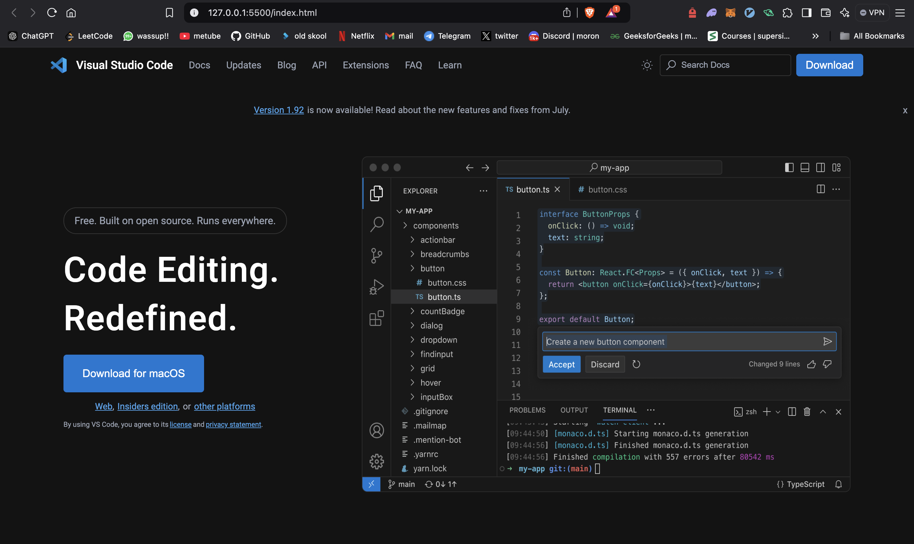

# VSCode Landing Page Clone

This project is a static front-end clone of the Visual Studio Code (VSCode) landing page. It showcases the same design as the original VSCode landing page and is built using HTML and CSS.

---

## Features

- Simple static layout (HTML and CSS only)
- Design inspired by the Visual Studio Code (VSCode) landing page
- Basic structure with content layout similar to the original

---

## Technologies Used

- **HTML5**: For structuring the content
- **CSS3**: For styling and layout
  - Flexbox and Grid
  
> **Note:** JavaScript has not been used in this version, and responsiveness is still to be implemented.

---

## Preview



> Screenshot of the landing page clone. Navigate to the project files to see the codebase.

---

## Installation

1. Clone the repository:
   ```bash
   git clone https://github.com/oldskoolmoron/vscode_landingpage.git
